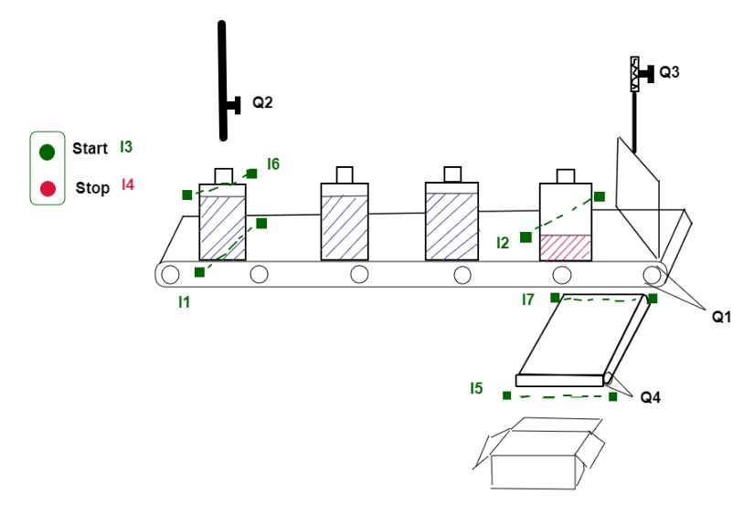

 ### PLC based faculty for detecting and removing empty bottles on conveyor
 
 This project is written using LOGO! Soft Comfort V8.2 (Ladder code).
 There are 7 inputs and 4 outputs for this controller.
 
 #### I/O as follows:
 
 * I1: Object sensor that detects when a bottle is on the conveyor. (Sensitive for glass)
 * I2: Detects if the last bottle on conveyor is empty or not. Set to 7 seconds for each bottle.
 * I3: Start botton
 * I4: Stop botton
 * I5: Sensor on 2nd conveyor that detects when the bottle has fallen into the box. (a counter could be added for specific quantities)
 * I6: Detects any sudden fluid overflow.
 * I7: Sensor in the 2nd conveyor for starting the 2nd conveyor in case of any empty bottles on the 1st conveyor.

- - -

 * Q1: 1st Conveyor's motor
 * Q2: Liquid control valve (Set to be opened for 5secs)
 * Q3: Diagonal metal plate - for deflecting the empty bottle
 * Q4: 2nd Conveyor's motor
 
 
 
  
